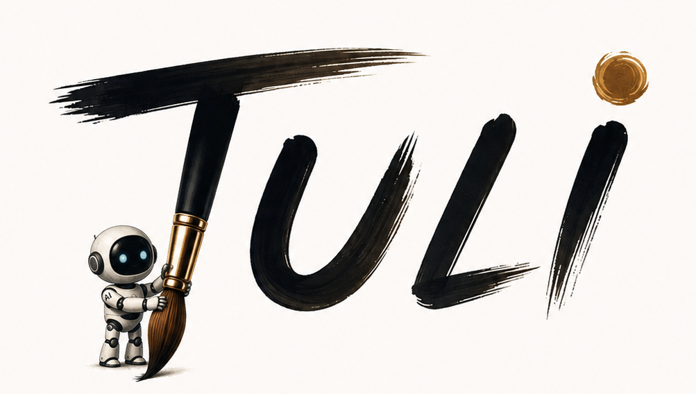

# Tuli

Tuli is a traditional Indian word for a paintbrush, representing the idea of expressing thoughts visually.

## Tuli for Models

Tuli for Models is a simple framework for giving AI models the ability to draw, visualize, and explain ideas through visuals.

### Why Tuli?

- Turns abstract ideas into visual representations
- Helps AI explain concepts more clearly through sketches and diagrams
- Bridges language and imagery for richer communication
- Makes model reasoning more interpretable and engaging

### Vision

Tuli is designed to help AI systems move beyond text-only interactions and become more expressive, creative, and intuitive by using visuals as part of the thinking and communication process.

### Project Status

This repository is being set up as the foundation for exploring visual reasoning and model-driven drawing workflows.
